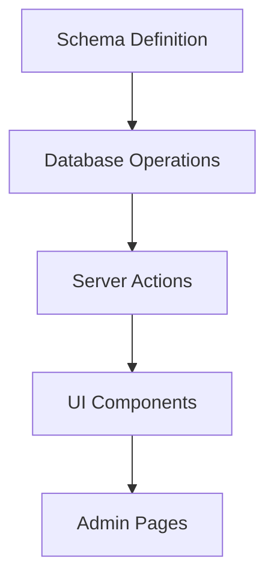

# Creating Forms Guide

This guide walks through the process of creating a new form in our application using the Form Factory System.

## Overview

Creating a form in our application involves several components:

1. **Schema Definition**: Define the data structure and validation rules
2. **Database Operations**: Create functions to interact with the database
3. **Server Actions**: Create form actions using the Form Factory
4. **UI Components**: Build the form interface using our reusable form components



## Step 1: Define the Schema

First, define the schema for your entity in the schema package:

```typescript
// packages/schema/src/entities/entity-name.ts
import { z } from 'zod';
import { schemaRegistry } from '../registry';

// Define the entity schema
export const entitySchema = z.object({
  name: z.string().min(1, "Name is required"),
  description: z.string().optional(),
  active: z.boolean().default(true),
});

// Register the schema
schemaRegistry.registerEntitySchema({
  name: 'entityName',
  version: '1.0.0',
  description: 'Schema for entity',
  schema: entitySchema,
  config: {
    name: { trim: true, titleCase: true },
    description: { trim: true },
  }
});

export type Entity = z.infer<typeof entitySchema>;
```

## Step 2: Create Database Operations

Create the database operations for your entity:

```typescript
// packages/database/src/tenant-app/operations/entity-name/create.ts
import { eq } from 'drizzle-orm';
import type { TenantDatabase } from '../../tenant-connection-db';
import { entities } from '../../schema/entities-schema';
import { Entity } from '@repo/schema/src/entities/entity-name';

export async function createEntity(
  db: TenantDatabase,
  data: Entity,
  user: { id: string }
) {
  const [newEntity] = await db.insert(entities)
    .values({
      name: data.name,
      description: data.description || null,
      active: data.active,
      createdBy: user.id,
      updatedBy: user.id,
    })
    .returning();

  return newEntity;
}
```

Don't forget to create an index file to export your operations:

```typescript
// packages/database/src/tenant-app/operations/entity-name/index.ts
export * from './create';
```

## Step 3: Create the Form Action

Use the Form Factory to create a server action:

```typescript
// apps/app/app/actions/entity/entity-name/create.ts
'use server';

import { createFormAction } from '../../form/create';
import { withAuth } from '../../../utils/with-auth';
import { createEntity } from '@repo/database/src/tenant-app/operations/entity-name';

export const createEntityAction = withAuth(
  createFormAction({
    entityType: 'entityName',
    dbOperation: createEntity,
    revalidatePaths: ['/admin/entity-name'],
    successRedirect: '/admin/entity-name',
  })
);
```

## Step 4: Create the Form Component

Create a React component for your form using our reusable form components:

```tsx
// apps/app/app/components/forms/entity-form.tsx
'use client';

import { entitySchema } from '@repo/schema/src/entities/entity-name';
import { z } from 'zod';
import { createEntityAction } from '../../../app/actions/entity/entity-name/create';
import { EntityForm } from '@/app/components/forms/entity-form';
import { TextField, TextareaField, SwitchField } from '@/app/components/forms/fields';

// Create a client-side validation schema
const formSchema = entitySchema;
type FormValues = z.infer<typeof formSchema>;

export function MyEntityForm() {
  return (
    <EntityForm<FormValues>
      schema={formSchema}
      defaultValues={{
        name: '',
        description: '',
        active: true,
      }}
      action={createEntityAction}
      successMessage={(data) => `Successfully created entity: ${data.name}`}
      errorMessage="Error creating entity"
      submitLabel="Create Entity"
      entityType="entityName"
    >
      <TextField
        name="name"
        label="Name"
        placeholder="Enter entity name"
        description="The name of the entity."
        required
      />
      
      <TextareaField
        name="description"
        label="Description"
        placeholder="Enter a description"
        description="Optional description of the entity."
      />
      
      <SwitchField
        name="active"
        label="Active"
        description="Whether this entity is currently active."
      />
    </EntityForm>
  );
}
```

## Step 5: Create the Page Component

Create a page component to display your form:

```tsx
// apps/app/app/(tenant)/admin/entity-name/new/page.tsx
import { MyEntityForm } from '@/app/components/forms/entity-form';

export default function NewEntityPage() {
  return (
    <div className="container mx-auto py-10">
      <div className="flex justify-between items-center mb-6">
        <h1 className="text-2xl font-bold">Create New Entity</h1>
      </div>
      <div className="bg-white p-6 rounded-lg shadow">
        <MyEntityForm />
      </div>
    </div>
  );
}
```

## Using the useEntityForm Hook Directly

For more complex forms, you can use the `useEntityForm` hook directly:

```tsx
'use client';

import { useEntityForm } from '@/app/hooks/use-entity-form';
import { Form } from '@repo/design-system/components/ui/form';
import { Button } from '@repo/design-system/components/ui/button';
import { TextField } from '@/app/components/forms/fields';

export function CustomEntityForm() {
  const { form, isPending, onSubmit } = useEntityForm({
    schema: formSchema,
    defaultValues: {
      name: '',
      // other fields...
    },
    action: createEntityAction,
    successMessage: 'Entity created successfully',
    errorMessage: 'Failed to create entity',
    entityType: 'customEntity',
  });

  return (
    <Form {...form}>
      <form onSubmit={form.handleSubmit(onSubmit)} className="space-y-6">
        <TextField
          form={form}
          name="name"
          label="Name"
          required
        />
        
        {/* Custom form fields and logic */}
        
        <Button type="submit" disabled={isPending}>
          {isPending ? 'Saving...' : 'Save'}
        </Button>
      </form>
    </Form>
  );
}
```

## Form Analytics

Our form components automatically track various analytics events:

1. **Form Started** - When a user first interacts with a form
2. **Field Interactions** - When users interact with specific fields
3. **Form Submission** - When a form is submitted
4. **Form Success** - When a form submission succeeds
5. **Form Error** - When a form submission fails
6. **Form Abandonment** - When a user leaves a form without submitting

## Form Components

For more detailed information about our reusable form components, please see the [Form Components Guide](./form-components-guide).

## Best Practices

1. **Use Reusable Components** - Always use the provided field components rather than creating custom ones
2. **Consistent Naming** - Use consistent naming for form fields across similar entities
3. **Proper Schema Validation** - Define comprehensive Zod schemas for validation
4. **Meaningful Error Messages** - Provide clear error messages for validation failures
5. **Analytics Context** - Always provide proper entityType and other context for analytics tracking
