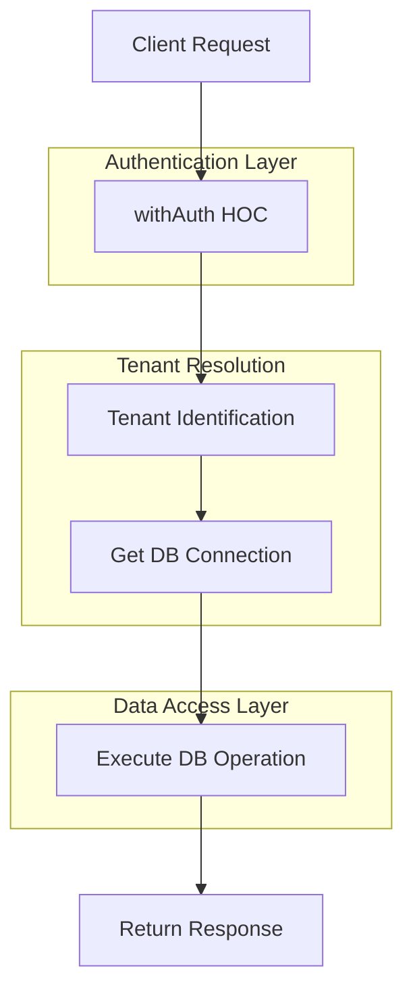

# Database Operations Guide

This guide explains our approach to database operations in the multi-tenant architecture of our application.

## Architecture Overview

Our application uses a multi-tenant architecture where:

1. Each tenant has its own database instance
2. The tenant is identified by the subdomain of the request
3. Database connections are managed centrally and provided to operations



## Database Operations Pattern

We follow a consistent pattern for all database operations:

### 1. Create Operation Files in the Correct Location

Database operations should be organized by entity type:

```
packages/database/src/tenant-app/operations/
├── [entity-name]/
│   ├── create.ts
│   ├── update.ts
│   ├── delete.ts
│   ├── get.ts
│   └── index.ts
```

### 2. Use Proper Typing

Always use the correct types for database operations:

```typescript
import type { TenantDatabase } from '../../tenant-connection-db';

export async function createEntity(
  db: TenantDatabase,
  data: EntityType,
  user: { id: string }
) {
  // Implementation
}
```

### 3. Export Operations from an Index File

Create an index file to export all operations for an entity:

```typescript
// packages/database/src/tenant-app/operations/entity-name/index.ts
export * from './create';
export * from './update';
export * from './delete';
export * from './get';
```

## Best Practices

### Type Safety

- Always use the `TenantDatabase` type for the database client
- Use entity-specific types for data parameters
- Define proper return types for all operations

```typescript
import type { TenantDatabase } from '../../tenant-connection-db';
import { Entity, NewEntity } from '../../schema/entity-schema';

export async function createEntity(
  db: TenantDatabase,
  data: NewEntity,
  user: { id: string }
): Promise<Entity> {
  // Implementation
}
```

### Error Handling

Database operations should handle errors appropriately:

```typescript
export async function createEntity(
  db: TenantDatabase,
  data: NewEntity,
  user: { id: string }
): Promise<Entity> {
  try {
    const [newEntity] = await db.insert(entities)
      .values({
        // Entity data
        createdBy: user.id,
        updatedBy: user.id,
      })
      .returning();

    return newEntity;
  } catch (error) {
    // Log error or handle specific database errors
    if (error.code === '23505') { // Unique constraint violation
      throw new Error(`Entity with this name already exists`);
    }
    throw error; // Re-throw for handling in the server action
  }
}
```

### Audit Fields

Always include audit fields in create and update operations:

- `createdBy` - The ID of the user who created the record
- `updatedBy` - The ID of the user who last updated the record
- `createdAt` - Timestamp of creation (usually handled by default values)
- `updatedAt` - Timestamp of last update (usually handled by default values)

### Soft Deletes

For entities that support soft deletes, use the following pattern:

```typescript
export async function deleteEntity(
  db: TenantDatabase,
  id: string,
  user: { id: string }
): Promise<Entity> {
  const [deletedEntity] = await db.update(entities)
    .set({
      deletedAt: new Date().toISOString(),
      deletedBy: user.id,
    })
    .where(eq(entities.id, id))
    .returning();

  return deletedEntity;
}
```

## Integration with Server Actions

Database operations are designed to be used with server actions through the `withAuth` HOC:

```typescript
// apps/app/app/actions/entity/entity-name/create.ts
'use server';

import { createFormAction } from '../../form/create';
import { withAuth } from '../../../utils/with-auth';
import { createEntity } from '@repo/database/src/tenant-app/operations/entity-name';

export const createEntityAction = withAuth(
  createFormAction({
    entityType: 'entityName',
    dbOperation: createEntity,
    revalidatePaths: ['/admin/entity-name'],
    successRedirect: '/admin/entity-name',
  })
);
```

## Complete Example

### Database Schema

```typescript
// packages/database/src/tenant-app/schema/entities-schema.ts
import { pgTable } from "drizzle-orm/pg-core";
import { uuid, timestamp, varchar, boolean } from "drizzle-orm/pg-core";
import { sql } from "drizzle-orm";
import { users } from "./users-schema";

export const entities = pgTable("entities", {
  id: uuid("id").defaultRandom().primaryKey().notNull(),
  name: varchar("name").notNull(),
  description: varchar("description", { length: 500 }),
  active: boolean("active").default(true).notNull(),
  
  // Timestamps
  createdAt: timestamp("created_at", { withTimezone: true, mode: 'string' })
    .default(sql`CURRENT_TIMESTAMP`)
    .notNull(),
  updatedAt: timestamp("updated_at", { withTimezone: true, mode: 'string' })
    .default(sql`CURRENT_TIMESTAMP`)
    .notNull(),
  deletedAt: timestamp("deleted_at", { withTimezone: true, mode: 'string' }),
  
  // Audit fields
  createdBy: uuid("created_by").references(() => users.id),
  updatedBy: uuid("updated_by").references(() => users.id),
  deletedBy: uuid("deleted_by").references(() => users.id)
});

export type Entity = typeof entities.$inferSelect;
export type NewEntity = typeof entities.$inferInsert;
```

### Database Operation

```typescript
// packages/database/src/tenant-app/operations/entity-name/create.ts
import { eq } from 'drizzle-orm';
import type { TenantDatabase } from '../../tenant-connection-db';
import { entities, type NewEntity } from '../../schema/entities-schema';

export async function createEntity(
  db: TenantDatabase,
  data: NewEntity,
  user: { id: string }
) {
  const [newEntity] = await db.insert(entities)
    .values({
      name: data.name,
      description: data.description || null,
      active: data.active,
      createdBy: user.id,
      updatedBy: user.id,
    })
    .returning();

  return newEntity;
}
```

### Server Action

```typescript
// apps/app/app/actions/entity/entity-name/create.ts
'use server';

import { createFormAction } from '../../form/create';
import { withAuth } from '../../../utils/with-auth';
import { createEntity } from '@repo/database/src/tenant-app/operations/entity-name';

export const createEntityAction = withAuth(
  createFormAction({
    entityType: 'entityName',
    dbOperation: createEntity,
    revalidatePaths: ['/admin/entity-name'],
    successRedirect: '/admin/entity-name',
  })
);
```

## Troubleshooting

### Common Issues

1. **Missing Tenant Context**: If you receive an error about missing tenant context, ensure you're accessing the application through a valid tenant subdomain.

2. **Database Connection Errors**: If you encounter database connection issues, check that the tenant has a valid connection URL in the main database.

3. **Type Errors**: If you see TypeScript errors related to database operations, ensure you're using the correct types for parameters and return values.

## Conclusion

Following this pattern ensures consistent, type-safe database operations across the application. It leverages our multi-tenant architecture while providing a clean separation of concerns between database operations and server actions.
